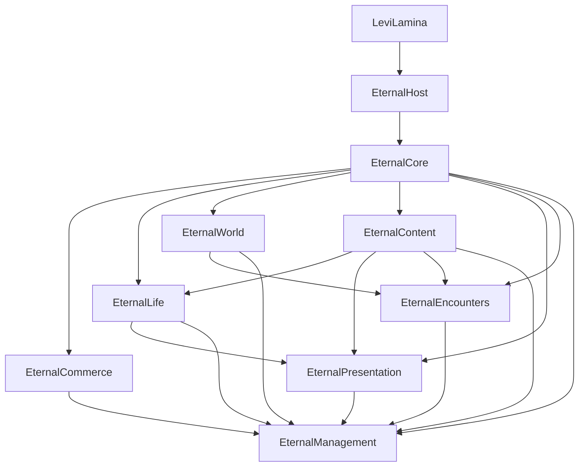

# 架构

目标运行图为 BDS → LeviLamina → EternalHost → 八个内部 DLL。LeviLamina 只发现 Host；业务 DLL 由 Host 发现、验证和调度，不作为八个 LL 插件注册。EternalSDK 是公共接口与辅助头，不是第九个业务模块。此目标属于 Phase 1.5，状态以 CURRENT_STATUS 与测试证据为准。

## 边界与数据所有权

| 组件 | 职责 | 不得接管 |
|---|---|---|
| EternalHost | LL/BDS 适配、模块发现、依赖排序、生命周期、服务注册和事件分发 | 钱包、职司、业务规则 |
| EternalCore | 可信身份、权限、coin/声望、资产事务、账本、回执、审计、迁移 | 签到、商店、土地、Boss 业务 |
| EternalCommerce | 钱庄、税、伴礼、商店、收购、寄售 | 另建权威余额 |
| EternalLife | 首入、签到/补签、成长、玩家任务进度、知己与资格 | 直接发行资产 |
| EternalWorld | 传送、死亡/遗物、道具、NPC、PVP、清扫、维护、原生宅地 | 复制 Core 权限或钱包 |
| EternalContent | 规则、公告、活动、委托定义、内容版本与发布 | 玩家进度和奖励结果 |
| EternalManagement | 管理入口、授权流程、审批、处罚和业务管理页面 | 越过业务 API 写库 |
| EternalPresentation | 主题、HUD、MOTD、诗笺呈现、中央提示和粒子 | 资产/称号资格权威 |
| EternalEncounters | Boss 模板/实例、战斗归因、资格和奖励申请 | 自建奖励钱包 |

模块只能打开自己的数据库。Core 是 coin 与声望的唯一写入者；Commerce/Life/Encounters 持久化业务申请，再通过经授权的 Core 接口申请结果。Content 拥有定义，Life 拥有玩家进度；World 拥有坐标、土地几何与成员；Management 只持有流程与结果引用。

## 依赖



箭头表示提供方至消费方。只声明实际使用的依赖；required 缺失、版本不兼容或依赖环须拒绝启用。optional 缺失时隐藏入口并返回明确不可用结果。Core 不反向依赖业务；失去 Core 时禁止资产写入，不回退私有余额。

## Host 与生命周期

Host 验证模块 ID、版本、ABI、能力与依赖，绑定 Host 生成的实例上下文。五个模块导出用于描述、加载、启用、停用与卸载；按依赖顺序启用，逆序停用。服务与事件订阅按实例归属回收，不能由模块伪造另一实例。停用应先撤销服务、停止入口、排空回调与持久任务，再释放私有资源。

LL首次Load在启动线程运行，首次Enable在服务器线程运行。仅Host适配层可在成功Load后、任何Enable尝试之前且完全静止时显式交接一次绑定线程；适配层须保证旧线程停止使用上下文，Host须无服务、订阅或分发中的回调。运行期间生命周期、服务和事件调用固定在该服务器线程，旧线程与再次启动交接均被拒绝；模块不能请求换线，普通停用或Enable失败也不重新开放交接。

最终停服另有仅供Host适配层调用的终止路径。首次交接时保留服务器线程的Windows SYNCHRONIZE句柄；只有WaitForSingleObject(handle, 0)明确返回线程已退出，且Host未在分发/忙碌/隔离状态，才允许最后交接到关闭线程，逆序Disable/Unload并永久禁止Load/Enable。LL的Stopping状态只表示关闭意图：非绑定线程上的该请求先延后，在公开typed leaveGameSync钩子调用origin返回后再核验句柄并完成终止。不能把Stopping、空事件队列或进程退出码当作线程已退出的证据。模块最终清理须允许在此关闭线程释放私有资源，不能继续访问已退出的游戏线程对象；真实停服验收见TEST_REPORT。

DLL 与引擎对象均在同一进程。实例上下文不是针对恶意 DLL 的内存隔离，也不是 Core 的玩家资产授权票据。Core 仍须从已认证引擎入口建立 actor、scope、角色、预算、时效和可撤销的能力链；该链未验收时资产接口保持 unsupported。

仅 Host 包含 LL/BDS 私有接口并链接其引擎适配依赖；内部模块面向 SDK。跨 DLL 只传版本化 POD/C 函数表，不传 STL、异常、分配器或 SQLite 句柄。游戏对象只在合法游戏线程访问；异步数据工作完成后回主线程并重新检查玩家和实例状态。

## 数据、交付与 UI

Core SQLite 使用 WAL、FULL、外键和原子事务；coin 使用 int64 最小单位分，100 分为一两。固定内部域的幂等唯一键为 executorScope + actorUuid + key，同键异请求拒绝。未来跨模块调用使用经验证的执行者作用域，不允许自报模块名授权。

钱包、账本、回执、审计与 outbox 原子提交；跨业务数据库和 BDS 背包不属于同一个事务。投影以当前 Core 权威值执行并按目标串行，或通过单调版本拒绝旧事件。物品交付不确定时进入人工核验，不盲目重发。

公共 UI 基础由 SDK/Core 契约统一，业务拥有页面与流程，Presentation 负责渲染。返回路径、取消、图标与主题能力须在真实客户端验证；渐变动画更新 HUD/MOTD/提示，不用反复弹表单冒充动画。业务规则见 docs/REQUIREMENTS.md，尚未实现的页面不算已交付。

## 目录

```text
host/EternalHost/             唯一 LL 适配插件
modules/EternalCore/{api,domain}/
modules/<其余七个模块>/        私有实现和模块入口
sdk/EternalSDK/               九类公共契约、C++ 辅助头与验证
sdk/EternalSDK/include/       标准 EternalSDK include 路径的转发头
migrations/<模块>/            编号 SQL
tests/                       域、ABI、Host 和集成测试
tools/                       构建、测试、打包与安全扫描
docs/                        可公开规格、锁与验收摘要
server/                      私人运行目录，不提交
```

目录存在、描述符可加载或 PLANNED 桩不代表业务功能实现。升级必须固定 BDS、LL 和工具链组合并重新验收；稳定自研 ABI 不能保证任意上游版本兼容。
